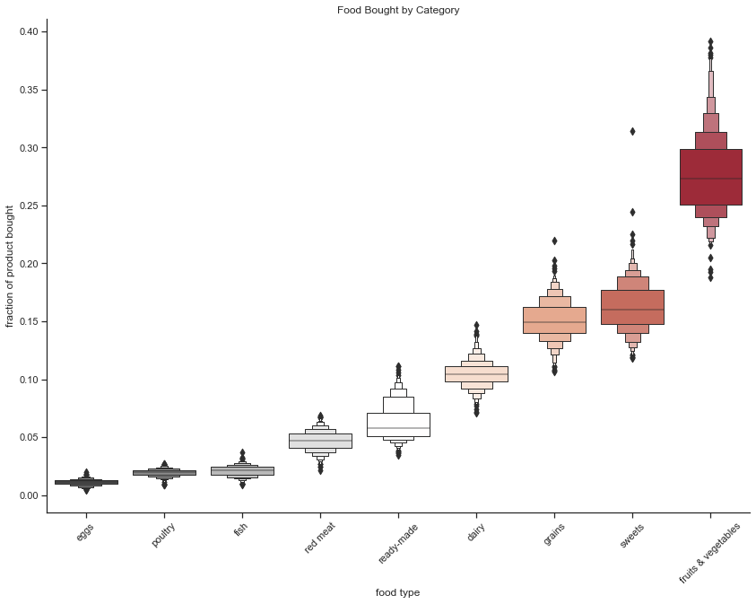
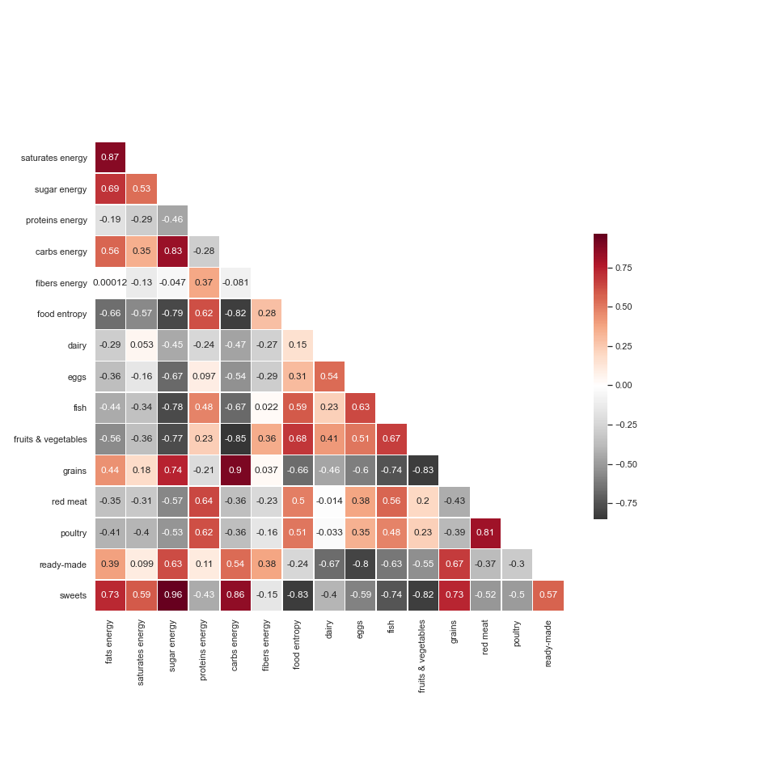
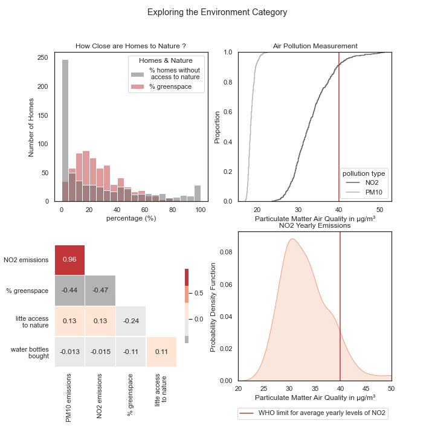
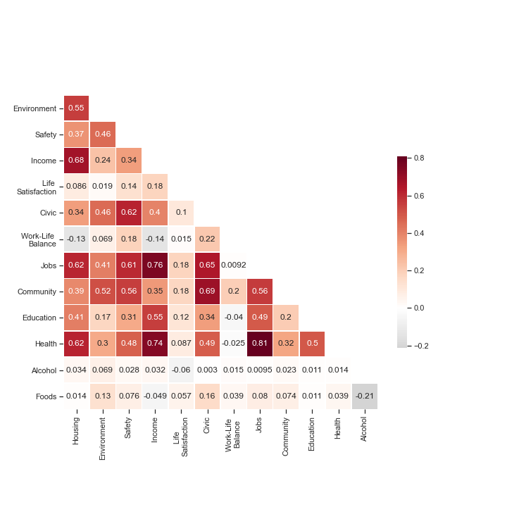

# An Overview of some Important Categories

Let's take a look at a few indicators to understand what is contained in them and what we are measuring ! We will only look at the two most interesting categories -- Food and Environment.

## Foods 

First up, it's important to understand what is inside the Foods category. What are people buying ? What are people eating ? 

We answer this question by plotting the frequency of the different categories of food contained in our dataset. We see that people tend to buy a lot more fruits and vegetables than any other categories. We also see that animal products do not make up a large part of what people buy. It's interesting to note that ready-made foods do not figure in the top purchased food items, but that sweets are very popular.
{: .mx-auto.d-block :}

The following heatmap shows us a lot about general nutrition. Fibers are found mainly in fruits and vegetables, as higlighted by the relatively strong correlation between fibers energy and fruits & vegetables. This also strongly correlates with food entropy, which represents the nutrient diversity of one area's typical shopping cart. It's suprising to see that ready-made items correlate with fibers energy. Also, areas that buy larger fractions of sweets obtain higher counts of energy from fats, sugar and carbs.

{: .mx-auto.d-block :}

Thus, the food indicator is made of a diverse set of food items and measures. As we will see, we will combine all these sub-indicators into one, to have an idea of which areas have a better diet.

## Environment 

This next category is all about measuring the condition of the environment. How clean is it? How much access to nature and greenspace is there in an area?

{: .mx-auto.d-block :}

Though the two indicators for air pollution, [PM10](https://www.eea.europa.eu/data-and-maps/indicators/emissions-of-primary-particles-and-5/assessment-3)  emissions and [NO2](https://www.epa.gov/no2-pollution#:~:text=NO2%20primarily%20gets%20in,%2C%20and%20off%2Droad%20equipment) emissions are highly correlated in the heatmap, they measure pollution at different levels. We see that PM10 pollution spans a different range from that of NO2 emissions in the top right corner of the image. NO2 emissions also have higher levels and about 10 percent of the London areas are above the [norm](https://www.who.int/news-room/fact-sheets/detail/ambient-(outdoor)-air-quality-and-health) set by the World Health Organisation, which indicates poor air quality. 

The two air pollution indicators are also negatively correlated to the percent of greenspace area. This suggests that the two indicators may also, to a certain extent, express how little green space there is.

## Sounds easy right ? But ... 

This was a brief overview of what is contained in our categories. This data is actually rescaled and normalized and sometimes inversed in order to compare the different values on the same scale. We need a bunch of categories to better capture importance of each sub-indicator, we cannot compare the pollution emitted via particle counts to a count of violent incidents happening in a neighborhood! 

Once we rescale all our data, we obtain relatively independent indicators. Some are quite strongly correlated, as income and jobs. This seems reasonable since areas that have high income also probably have lucrative jobs. On the other hand, work-life balance is negatively correlated with income, which makes sense as we approximate the former by using the proportion of part-time employees in the area. So, the lower income of some areas could be explained by having more free-time, and won't be penalized as much in our indicator. Anyway, have a look yourself :

{: .mx-auto.d-block :}

Some indicators are not really correlated to any of the others, but that's good! It means they bring something new to the analysis.

Once our sub-indicators are created, we look to optimize the weights attributed to each category. We employ the same method as for the sub-indicators, [Principle Component Analysis (PCA)](https://towardsdatascience.com/the-mathematics-behind-principal-component-analysis-fff2d7f4b643) to determine the directions that contains the most variance, and assigning them more important weights. This process allows us to **optimize** the weights. In the end, we obtain an index containing the contribution of each indicators, which in turn is composed of sub-indicators. This index is a weighted sum of the indicators, that optimally represents the data we have and reflects accurately what is going on in the Greater London Area. 

[Let's find out the results !](https://charlyneburki.github.io/The-ALDI/map/) 

