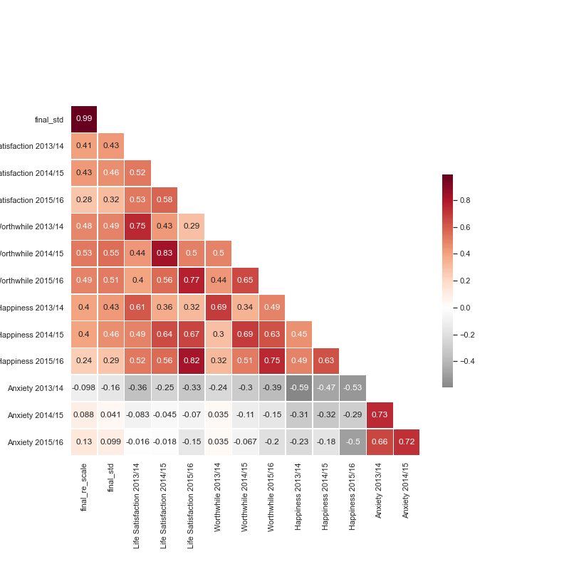

## How do you know the Index actually reflects life quality ?

We don't! This index is only an indicator based on a couple of factors. If one thinks that income, for example, is the sole factor in life quality, well, our index is definitely irrelevent. In the end, it is a subjective question and it is much more justified to apply these kind of indexes when comparing countries developement levels. However, if you ever decide to move to London it might help you choose an area. It's also a nice tool to see how indicators influence, or don't influence each other.    

### But does it mean something ? 

While browsing the web for datasets, we stumbled upon an excel file made by the Greater London Authority that measured well-being based on happiness, worthwhile, life satisfaction and anxiety. This is the same data used for [this map](https://www.timeout.com/london/blog/this-map-shows-londons-happiest-and-saddest-boroughs-100516). To prove that ALDI is relevent, we looked at how our index correlates with these subjective well-being questions asked to people all over London. In the following heatmap, we can see our final index, computed with two different normalisation methods:

{: .mx-auto.d-block :}

## So ... 

We have created an index that could estimate the life quality of different areas, based on a number of factors. It correlates quite well with happiness, worthwhile and life satisfaction, and it doesn't with anxiety (even though we would prefer to see negative correlation here, it is possible that anxiety is unrelated to the human development). In conclusion, we can state that it is better than self-reported factors (although we include some too), as it takes into account more objective life developement indicators. 

Thanks for staying with us 'till the end.

The DataSurferZ team 🌊 
