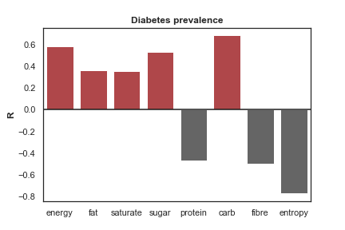

## How are people doing ? 

Quality of life has become an increasingly valuable factor in determining policies, governing strategic development and rethinking the way humans evaluate life. A lot of research has gone into improving humans life standard. Recently, indicators such as the [Human Development Index](http://hdr.undp.org/en/content/human-development-index-hdi) (HDI) or customized indices like the [OECD Better Life Index](http://www.oecdbetterlifeindex.org/#/11111111111) have emerged to account for other facets of life instead of simple GDP per capita. The advantages of employing a custom-made index is that a myriad of factors are accounted for, such that we are able to obtain a more accurate reading of “life” and answer the question _"how's life ?"_.

## Why should I care about Indexes ?

Indexes are usually employed to compare countries to one another, allowing organisation such as OECD or the UN to rank countries based on set criteria and produce valuable statistics regarding development and economics. Often, these indexes are included in facts presented to world-wide leaders to set planetary goals of reducing poverty, hunger and carbon emissions. On a more local level, they can be employed to reflect [housing prices](https://www.homesandproperty.co.uk/property-news/the-best-place-to-live-in-london-revealed-in-new-report-into-the-uks-wellbeing-a124381.html) and much more. Read on to learn how we applied that concept to the Greater London Area !

## Introducing ... ALDI !

We propose a new and improved index to rank, not countries, but local regions in the Greater London Area, in England. More particularly, we look at [wards](https://en.wikipedia.org/wiki/Wards_and_electoral_divisions_of_the_United_Kingdom) and boroughs which are both structural localities specific to England. Producing statistics at this level allows, among other things, to read which policies work best in those particular regions.  

The ALDI uses standard categories employed in the OECD's ranking:

  * Housing
  * Income
  * Jobs
  * Community
  * Education
  * Environment
  * Civic Engagement
  * Health
  * Life Satisfaction
  * Safety
  * Work-Life Balance

and additionally a **Foods** category and an **Alcohol** category. 

Given the availability of precise food data introduced in the [Tesco Grocery 1.0 ](https://www.nature.com/articles/s41597-020-0397-7) paper at different geographical levels, we aimed to explore whether we could extrapolate this data not only to health but to other life indicators. Ultimately, we wanted to see if we could create a new and improved life developpement index which includes food consumption to better predict which areas of London are the best to live in. Right now, little visualisation exist that showcase life quality in the Greater London Area. We only found this super acurate map of London Borough happiness, found from [this website](https://www.timeout.com/london/blog/this-map-shows-londons-happiest-and-saddest-boroughs-100516). It ranks boroughs according to their subjective happiness levels:

{: .mx-auto.d-block :}

## But what has food got to do with life quality ?

Much research has concluded that there is an association between eating healthier, varied diets and [higher education](https://www.cambridge.org/core/journals/public-health-nutrition/article/relationship-between-education-and-food-consumption-in-the-1995-australian-national-nutrition-survey/8464FAE847878D59E8D2DD2D06ABB123), converserly more high-fat, caloric diets and [lower education](https://www.sciencedaily.com/releases/2013/11/131106202251.htm), and leading a happier life and [eating healthier](https://link.springer.com/article/10.1007/s11482-019-09748-7#:~:text=Both%20studies%20found%20positive%20correlations,level%20was%20not%20investigated%20longitudinally). Furthermore, as the [Tesco Grocery 1.0 ](https://www.nature.com/articles/s41597-020-0397-7) paper demonstrated, diets rich in sugar, carbs and fats contribute to diabetes prevalance whereas larger diversity in our diets, proteins, and fibers all contribute to healthier lifestyles, as seen in this figure : 

{: .mx-auto.d-block :}

So we will have a look at how food habits influence our index, by looking at how it is correlated to other indicators, and how much it matters to include it in a life developpement index.

## But what is an Index and how is it calculated ?

Great question ! In fact, it's important to understand the basics underlying this measurement. An index is made of aggregated data according to different topics. For instance, when we talk about measuring the education level in our dataset, we aggregate data ranging from [GECD](https://en.wikipedia.org/wiki/General_Certificate_of_Secondary_Education) scores to the highest qualification earned when a working adult fills out a census form. These values are then normalized for each to be on the same scale, to allow for unbiased comparaison. Once all the factors for an indicator have been normalized, they must be evaluated for independence, in the sense that they must not be correlated (otherwise we would be giving a factor more weight than necessary). Once we obtain an indicator for all our 13 different categories, we must once more make sure that these factors are not correlated in order to have a most accurate assessment of the life standard. 

Lastly, we arrange our data such that a higher score reflects a positive impact on life. For example, the raw data for crime rate will naturally be higher for areas that have more crimes. Thus, we need to inverse that particular scale which allows us to have a scale that reflectls only positively.  

To create ALDI, we followed the recommandations set by the European Union's Joint Research Center in their paper [Tools for Composite Indicators Building](https://publications.jrc.ec.europa.eu/repository/bitstream/JRC31473/EUR%2021682%20EN.pdf?fbclid=IwAR1fziDRyxp6F9B6RAk6wT7pvjBuxs3zV56L-GwR2XYZyczYuDKSd9jy990) in 2005. 

[Let's get to it !](https://charlyneburki.github.io/The-ALDI/aldi/) 

