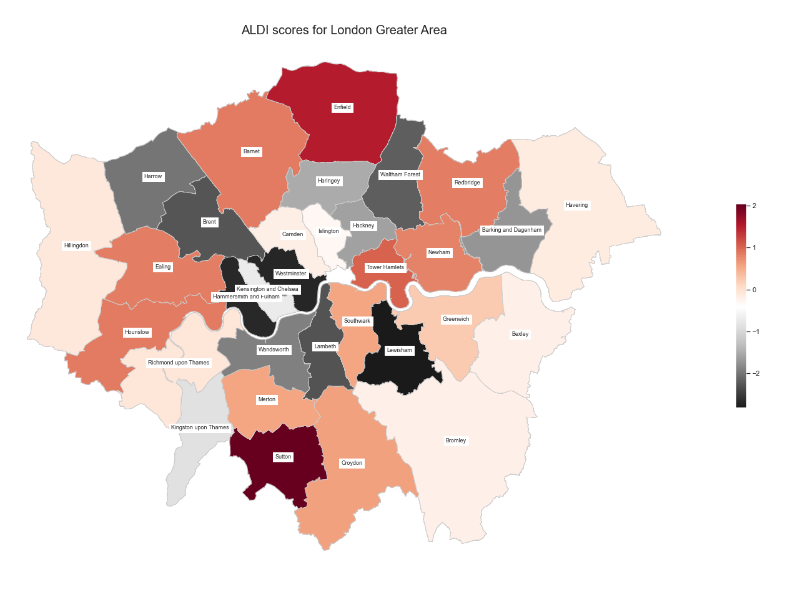

# What does the Index result in ? 

Here, we display the optimized weights and the Greater London Area maps that result from the ALDI ranking process. 

{: .mx-auto.d-block :}

We observe that the weights given to each categories have been distributed in such a way that each factor will contribute proportionally to evaluating life. Note also that the **Foods** and **Alcohol** categories have adequate weights to factor in, which is quite nice for our method ! 

We then plot the overall ALDI score, with the weights above, to the Ward level in the Greater London Area.

The map :

{: .mx-auto.d-block :}

The borough-level map:
{: .mx-auto.d-block :}

# Discussion on food 

{: .mx-auto.d-block :}

# Want to play around with the weights  ?

We provide sliders for you to customize your index ! You can choose what categories are important to you and attribute them larger weights, and see how the boroughs evolve !

< interactive maps and weights > 
{: .mx-auto.d-block :}

<iframe
  src="https://raw.githubusercontent.com/charlyneburki/The-ALDI/master/assets/img/map.html"
  style="width:100%; height:600px;"
></iframe>

  

