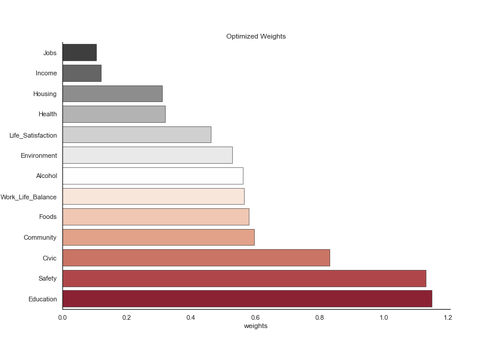
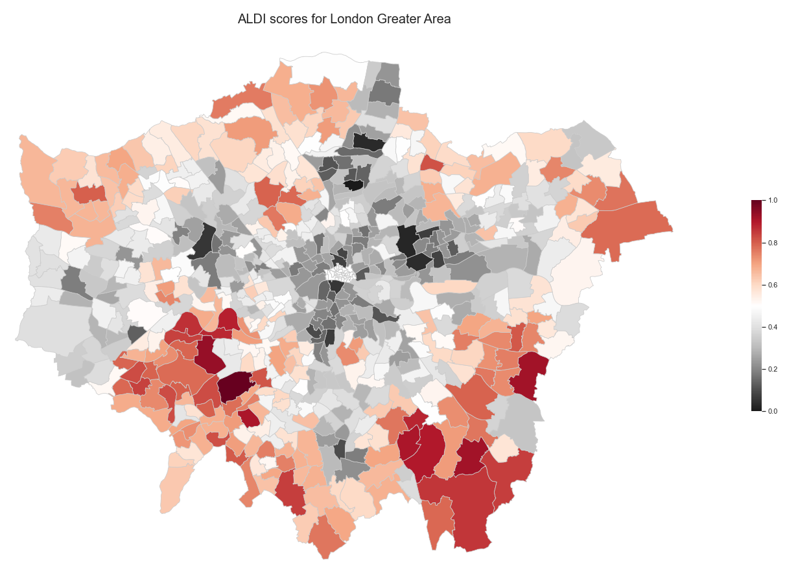

# What does the Index result in ? 

Here, we display the optimized weights and the Greater London Area maps that result from the ALDI ranking process. 

{: .mx-auto.d-block :}

We did not choose these weights but they were chosen by the magics of mathematics and PCA. The result of this analysis is generaly to lower weights for correlated indicators. If you remember the last heatmap of [the index](https://charlyneburki.github.io/The-ALDI/aldi/), we saw that jobs, income and health are quite correlated together, and they all three have relatively small weigths, because they express the same thing in a way. On the other hand education is correlated with most other indicators, relatively strongly with some and quite lightly for others. It got a high weight, meaning that it probably captures some aspects in areas that are unique to education. Other indicators, like food or life satisfaction are food barely correlated to other variables, and thus have an average weigth. In the end we can only accept the results as they come, as PCA captures also correlations between groups of indicators, a much more advanced analysis of the results is needed to explain everything we see here.

The good thing with the ALDI is that these weights don't have to be taken for granted, as one can have a look at our interactive map to manually choose the relative weights. But have a look at the following map, where the weights displayed above were used to compute the ALDI, first on the ward level in the Greater London Area and subsequently aggregate to the borough level.

{: .mx-auto.d-block :}

It's interesting to note that outer-most wards score genereally better than those close to the City Center. Since this map is quite detailed, we aggregate the data to the borough level and see which boroughs perform better: 

{: .mx-auto.d-block :}

It's already easier to read the data ! It also resembles the initial happiness map measuring anxiety and subjective happiness.

# Want to play around with the weights  ?

We provide sliders for you to customize your index ! You can choose what categories are important to you and attribute them larger weights, and see how the boroughs evolve !

< interactive maps and weights > 
{: .mx-auto.d-block :}

  

