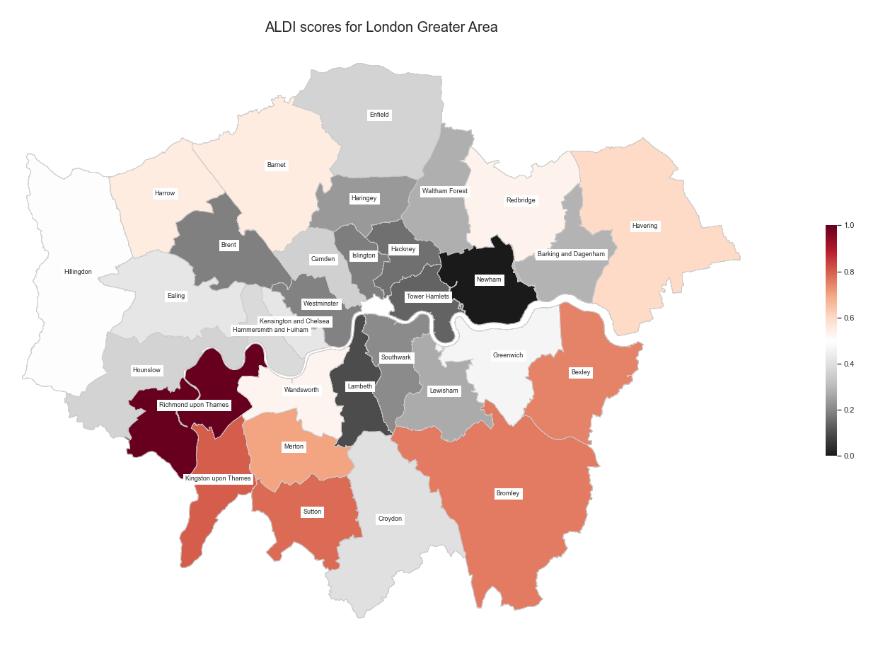

# What does the Index result in ? 

Here, we display the optimized weights and the Greater London Area maps that result from the ALDI ranking process. 

{: .mx-auto.d-block :}

The resulting weights were chosen by the magic of mathematics and PCA. The goal of this analysis is generally to lower weights for correlated indicators. If you remember the last heatmap of [the index](https://charlyneburki.github.io/The-ALDI/aldi/), we saw that jobs, income and health were quite correlated together. All three of them also had relatively small weigths because they express a similar idea, in a way. Additionally, education is correlated with most other indicators, relatively strongly with some and quite lightly for others. It obtained a high weight, meaning that unique aspects of education can be quite representative for the development of a region. Other indicators, like food or life satisfaction, are barely correlated to other variables and therefore have average weights. To better understand  the results of advanced analysis, read the following paper, which explains the mathematical approach that we have applied: https://publications.jrc.ec.europa.eu/repository/bitstream/JRC31473/EUR%2021682%20EN.pdf

The good thing with the ALDI is that these weights don't have to be taken for granted. You can have a look at our interactive map to manually choose the relative weights. But first, have a look at the following map, where the weights displayed above were used, first on the ward level in the Greater London Area and subsequently aggregated to the borough level.

{: .mx-auto.d-block :}

It's interesting to note that outer-most wards score is genereally better than those close to the City Center. Since this map is quite detailed, we aggregate the data to the borough level and see which boroughs perform better: 

{: .mx-auto.d-block :}

It's already easier to read the data ! It also resembles the initial happiness map measuring anxiety and subjective happiness.

# Want to play around with the weights?

We provide sliders for you to customize your index ! You can choose what categories are important to you and attribute them larger weights, and see how the boroughs evolve !



[Our conclusion](https://charlyneburki.github.io/The-ALDI/conclusion/) 
